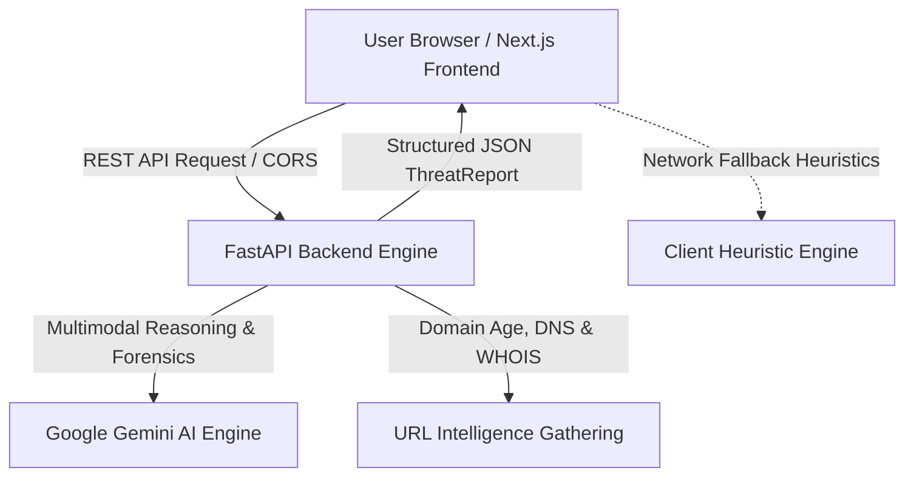

# 🛡️ ScamGuard — Personal Cyber Threat & Scam Defense Engine

> **Don't just detect the scam. Understand the attack.**  
> An instant, free, privacy-first threat analysis platform that unpacks deceptive SMS, emails, screenshots, and URLs into actionable intelligence and educational forensics.

---

## 📌 Table of Contents

- [Overview & Problem Statement](#-overview--problem-statement)
- [Key Features](#-key-features)
- [Architecture & Tech Stack](#-architecture--tech-stack)
- [Prerequisites](#-prerequisites)
- [Quick Start Guide](#-quick-start-guide)
  - [1. Clone Repository](#1-clone-repository)
  - [2. Backend Setup (FastAPI & Gemini AI)](#2-backend-setup-fastapi--gemini-ai)
  - [3. Frontend Setup (Next.js & Tailwind CSS)](#3-frontend-setup-nextjs--tailwind-css)
- [Gemini API Key Setup Guide](#-gemini-api-key-setup-guide)
- [Environment Variables Reference](#-environment-variables-reference)
- [How to Run Both Servers](#-how-to-run-both-servers)
- [API Documentation & Endpoints](#-api-documentation--endpoints)
- [Verification & Testing](#-verification--testing)
- [Privacy & Zero-Retention Security](#-privacy--zero-retention-security)
- [Contributing & License](#-contributing--license)

---

## 🔍 Overview & Problem Statement

Online fraud and social engineering attacks are growing exponentially in sophistication. Everyday consumers receive deceptive SMS messages, fake banking alerts, spoofed delivery texts, and urgent verification demands.

**The core issue is not detection alone.** Ordinary users need answers to four critical questions within 3 seconds:
1. **Is this actually a scam?** — An unambiguous risk score (Safe, Suspicious, Critical).
2. **How does the attack work?** — A clear breakdown of the psychological and technical progression.
3. **What is the attacker trying to steal?** — Login credentials, 2FA codes, money, or personal identity.
4. **What should I do right now?** — High-contrast, concrete **Do's and Don'ts** without technical jargon.

**ScamGuard delivers a comprehensive Threat Report in seconds with zero data stored.**

---

## ✨ Key Features

- 💬 **Paste Message Analysis**: Inspect suspicious SMS, WhatsApp forwards, phishing emails, and direct messages.
- 📸 **Screenshot OCR & Visual Inspection**: Upload screenshots of text threads, emails, or app alerts. Multimodal AI extracts visible text and analyzes visual brand spoofing.
- 🔗 **URL Technical Forensics**: Inspect suspicious links safely without visiting them — checking DNS resolution, domain age, registrar authenticity, and top-level domain abuse (.cc, .xyz, .top).
- 🎯 **Circular Risk Meter**: Intuitive visual gauge displaying exact risk percentage (0–100%) and clear human qualitative status (**Minimal Risk**, **Suspicious**, **Critical Threat**).
- ⛓️ **Step-by-Step Attack Chain**: Visual timeline revealing how the scammer staged the attack from initial bait to final credential harvesting.
- 🛡️ **Actionable Do's & Don'ts**: Bold, color-coded immediate action cards guiding the user on what to avoid and how to safely verify with official channels.
- 🔒 **Zero-Retention Privacy**: Encrypted ephemeral sandboxing — no submitted text, images, or URLs are ever persisted to disk or databases.
- ⚡ **Resilient Offline Fallback**: Dual-layer architecture with built-in heuristic analysis ensuring the user interface always returns instant results even during network disruptions.

---

## 🏗️ Architecture & Tech Stack



- **Frontend**: Next.js 16 (Turbopack, App Router), React 19, TypeScript, Tailwind CSS v4, Material Symbols.
- **Backend**: FastAPI, Python 3.11+, Uvicorn, Pydantic v2.
- **AI Engine**: Google GenAI SDK (`google-genai`), Gemini 3.6 / 2.5 Flash models with strict JSON schema enforcement.
- **URL Intelligence**: Python `dnspython`, `python-whois`, `urllib`.

---

## 📋 Prerequisites

Ensure you have the following installed on your machine:
- **Node.js**: `v18.18.0` or higher (`node -v`)
- **npm**: `v9.0.0` or higher (`npm -v`)
- **Python**: `v3.10` or higher (`python --version`)
- **Git**: `git --version`

---

## 🚀 Quick Start Guide

### 1. Clone Repository

```bash
git clone https://github.com/your-username/scamguard.git
cd scamguard
```

---

### 2. Backend Setup (FastAPI & Gemini AI)

Open a terminal in the project directory:

```bash
# 1. Navigate to backend
cd backend

# 2. Create Python virtual environment
python -m venv venv

# 3. Activate virtual environment
# On Windows (PowerShell):
.\venv\Scripts\Activate.ps1
# On Windows (Command Prompt):
.\venv\Scripts\activate.bat
# On macOS / Linux:
source venv/bin/activate

# 4. Install backend dependencies
pip install -r requirements.txt

# 5. Create environment configuration
copy .env.example .env    # On Windows
# cp .env.example .env     # On macOS/Linux
```

---

### 3. Frontend Setup (Next.js & Tailwind CSS)

Open a **second terminal** in the project directory:

```bash
# 1. Navigate to frontend
cd frontend

# 2. Install Node dependencies
npm install

# 3. Create frontend local environment file
copy .env.example .env.local    # On Windows
# cp .env.example .env.local     # On macOS/Linux
```

---

## 🔑 Gemini API Key Setup Guide

ScamGuard utilizes Google Gemini AI to analyze social engineering tactics and deceptive patterns.

1. Go to **[Google AI Studio](https://aistudio.google.com/)**.
2. Sign in with your Google account.
3. Click **"Get API Key"** and then **"Create API Key in new project"**.
4. Copy your generated API key.
5. Open `backend/.env` in any text editor and paste your key:

```env
GEMINI_API_KEY=AIzaSyYourGeneratedGeminiKeyHere
GEMINI_MODEL=gemini-3.6-flash
CORS_ORIGINS=http://localhost:3000
```

> **Note**: If no API key is provided or during offline testing, ScamGuard automatically utilizes its built-in rule-based heuristic threat engine to generate comprehensive reports seamlessly.

---

## ⚙️ Environment Variables Reference

### Backend (`backend/.env`)

| Variable | Description | Default / Example |
| :--- | :--- | :--- |
| `GEMINI_API_KEY` | Google Gemini API Key | `AIzaSy...` (Required for live AI) |
| `GEMINI_MODEL` | Gemini Model identifier | `gemini-3.6-flash` |
| `SAFE_BROWSING_API_KEY` | Google Safe Browsing Lookup Key | *(Optional)* |
| `CORS_ORIGINS` | Permitted frontend origins | `http://localhost:3000` |

### Frontend (`frontend/.env.local`)

| Variable | Description | Default / Example |
| :--- | :--- | :--- |
| `NEXT_PUBLIC_API_URL` | Base URL of the FastAPI Backend | `http://localhost:8000` |

---

## 🏃 How to Run Both Servers

### Terminal 1: Run Backend (FastAPI on Port 8000)

```powershell
cd backend
.\venv\Scripts\Activate.ps1
uvicorn main:app --reload --host 127.0.0.1 --port 8000
```
- **Backend API**: [http://127.0.0.1:8000](http://127.0.0.1:8000)
- **Interactive Swagger Docs**: [http://127.0.0.1:8000/docs](http://127.0.0.1:8000/docs)
- **Health Check**: [http://127.0.0.1:8000/health](http://127.0.0.1:8000/health)

---

### Terminal 2: Run Frontend (Next.js on Port 3000)

```powershell
cd frontend
npm run dev
```
- **Web Application**: [http://localhost:3000](http://localhost:3000)

---

## 📡 API Documentation & Endpoints

| Method | Endpoint | Description |
| :--- | :--- | :--- |
| `GET` | `/health` | Server health check and status monitoring. |
| `POST` | `/api/analyze/text` | Analyzes suspicious text message, SMS, email, or chat for scam indicators. |
| `POST` | `/api/analyze/image` | Multimodal endpoint: extracts OCR text and inspects screenshots for visual spoofing. |
| `POST` | `/api/analyze/url` | Inspects suspicious URLs, resolves DNS, evaluates domain age, and computes risk score. |

### Sample Analysis Request

```bash
curl -X POST "http://localhost:8000/api/analyze/text" \
     -H "Content-Type: application/json" \
     -d '{"content": "URGENT: Your Chase bank account has been locked. Verify here: https://chase-security-resolver.cc/auth"}'
```

---

## 🧪 Verification & Testing

### Backend Unit & Integration Tests

```bash
cd backend
.\venv\Scripts\python.exe test_backend.py
```

### Frontend Type Safety & Build Check

```bash
cd frontend
npx tsc --noEmit
npm run build
```

---

## 🔐 Privacy & Zero-Retention Security

ScamGuard is engineered around zero-retention privacy principles:
- **No User Tracking**: No accounts, logins, cookies, or profiling.
- **Ephemeral Processing**: All analyzed text, images, and URLs reside strictly in transient memory during computation and are immediately discarded.
- **No Database Persistence**: No submission history or telemetry is written to disks or remote databases.
- **Safe Sandboxing**: URLs submitted for inspection are analyzed via DNS and WHOIS metadata without executing client-side scripts or malware payloads.

---

## 📄 License

This project is licensed under the MIT License — see the [LICENSE](LICENSE) file for details.
