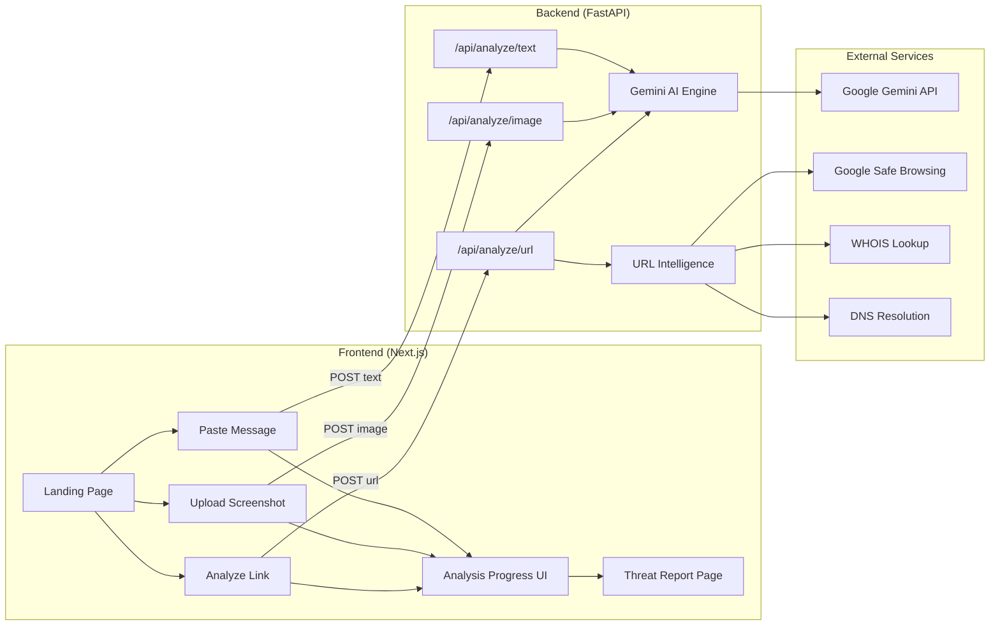

# ScamGuard — Full Implementation Plan

A free, privacy-first web application that analyzes suspicious messages, screenshots, and URLs to produce detailed, plain-English threat analysis reports powered by Gemini AI and real URL intelligence APIs.

---

## User Review Required

> [!IMPORTANT]
> **Gemini API Key**: You'll need a Google AI Studio API key (`GEMINI_API_KEY`). The plan uses `gemini-2.0-flash` for speed and cost efficiency.

> [!IMPORTANT]
> **Google Safe Browsing API Key**: For real URL threat lookups, you'll need a Google Cloud project with the Safe Browsing API enabled and an API key (`SAFE_BROWSING_API_KEY`).

> [!WARNING]
> **OCR for Screenshot Analysis**: The plan uses Gemini's native vision capability (multimodal input) to extract text from uploaded screenshots instead of a separate OCR service. This keeps the stack simple and avoids an extra dependency. If you prefer Tesseract or Google Cloud Vision OCR instead, let me know.

> [!IMPORTANT]
> **No Database**: Per the zero-retention privacy principle, there is no database. Analysis requests are ephemeral — processed and discarded. No user accounts, no login, no stored history.

---

## Open Questions

1. **Rate Limiting** — Should there be a rate limit on the API (e.g., 10 analyses per IP per hour) to prevent abuse? I recommend yes, implemented via in-memory rate limiting with `slowapi` on FastAPI.

2. **Deployment Target** — Where do you plan to deploy this? Options:
   - **Vercel** (frontend) + **Railway/Render** (backend) — simple, free tier available
   - **Single VPS** (both) — full control
   - **Google Cloud Run** — good fit given the Gemini API dependency
   - This doesn't affect the codebase structure, just environment config later.

3. **Custom Domain** — Do you have a domain in mind, or is localhost-only fine for now?

---

## Architecture Overview



The system is a **two-service architecture**:
- **Frontend (Next.js)** — serves the UI, handles routing, manages analysis state
- **Backend (FastAPI)** — receives analysis requests, orchestrates Gemini AI calls, performs URL intelligence lookups, returns structured threat reports

They communicate over HTTP/REST. The frontend calls the backend API endpoints. No shared state, no database.

---

## Proposed Changes

### Backend — FastAPI + Gemini AI Engine

The backend is a standalone Python service responsible for all intelligence processing.

---

#### [NEW] [requirements.txt](file:///c:/Users/admin/Desktop/ScamGuard/backend/requirements.txt)

Dependencies:
| Package | Purpose | Why this one |
|---|---|---|
| `fastapi` | Web framework | Async, fast, auto-generates OpenAPI docs |
| `uvicorn` | ASGI server | Production-grade server for FastAPI |
| `google-genai` | Gemini API SDK | Official Google GenAI Python SDK |
| `python-multipart` | File uploads | Required for screenshot upload handling |
| `httpx` | HTTP client | Async HTTP calls for Safe Browsing, WHOIS, DNS |
| `python-whois` | WHOIS lookup | Domain registration data for URL analysis |
| `slowapi` | Rate limiting | Prevents API abuse per IP |
| `pydantic` | Data validation | Already part of FastAPI, used for request/response models |
| `python-dotenv` | Env vars | Loads `.env` file for API keys |

No ORM, no database driver, no session management — intentionally lightweight.

---

#### [NEW] [main.py](file:///c:/Users/admin/Desktop/ScamGuard/backend/main.py)

The FastAPI application entry point:
- CORS middleware (allows frontend origin)
- Rate limiting middleware (slowapi)
- Health check endpoint (`GET /api/health`)
- Mounts the three analysis routers

---

#### [NEW] [routers/analyze_text.py](file:///c:/Users/admin/Desktop/ScamGuard/backend/routers/analyze_text.py)

`POST /api/analyze/text`

- **Input**: `{ "content": "suspicious message text here" }`
- **Validation**: Content must be 1–5000 characters, non-empty after trimming
- **Process**: Sends the message to Gemini with a structured prompt that asks for:
  - Risk score (0-100)
  - Threat level (CRITICAL / SUSPICIOUS / SAFE)
  - Verdict (1-sentence summary)
  - Threat indicators (array of detected red flags)
  - Explanation sections (why it's suspicious, written for non-technical readers)
  - Attack chain (ordered list of tactics used)
  - Recommended actions (do/don't list)
- **Output**: Structured JSON matching the `ThreatReport` schema (see models below)
- **Error handling**: Gemini API timeout, rate limit exceeded, invalid input, malformed AI response

---

#### [NEW] [routers/analyze_image.py](file:///c:/Users/admin/Desktop/ScamGuard/backend/routers/analyze_image.py)

`POST /api/analyze/image`

- **Input**: Multipart file upload (PNG, JPG, JPEG, HEIC, max 15MB)
- **Validation**: File type check, file size check
- **Process**:
  1. Read the uploaded image bytes into memory (never written to disk)
  2. Send to Gemini as a multimodal prompt (image + text instruction)
  3. Gemini extracts the text from the screenshot and analyzes it in a single call
  4. Returns the same `ThreatReport` schema
- **Output**: Same structured JSON as text analysis, plus an `extracted_text` field showing what was read from the image
- **Error handling**: Unsupported file type, file too large, Gemini vision failure, unreadable image

---

#### [NEW] [routers/analyze_url.py](file:///c:/Users/admin/Desktop/ScamGuard/backend/routers/analyze_url.py)

`POST /api/analyze/url`

- **Input**: `{ "url": "https://suspicious-domain.com/path" }`
- **Validation**: Must be a valid URL format, reasonable length
- **Process** (parallel where possible):
  1. **Google Safe Browsing API** — Check if the URL is in Google's threat database (malware, social engineering, unwanted software)
  2. **WHOIS lookup** — Domain registration date, registrar, expiry (newly registered domains are a red flag)
  3. **DNS resolution** — Resolve the domain, check for suspicious hosting patterns
  4. **Gemini AI analysis** — Analyze the URL structure itself (suspicious subdomains, misleading TLD, brand impersonation in the domain name, deceptive path patterns)
  5. Combine all signals into a unified threat report
- **Output**: `ThreatReport` schema plus a `url_intelligence` section containing:
  - Safe Browsing verdict
  - Domain age
  - Registrar
  - DNS records
  - Redirect chain (if followed)
- **Error handling**: Invalid URL, Safe Browsing API failure (degrade gracefully — still return AI analysis), WHOIS timeout, DNS failure

---

#### [NEW] [services/gemini_engine.py](file:///c:/Users/admin/Desktop/ScamGuard/backend/services/gemini_engine.py)

The AI analysis core. Responsibilities:
- Initialize the Gemini client with the API key
- Define the system prompt that instructs Gemini to behave as a scam analysis engine
- Define the structured output schema (using Gemini's JSON mode / structured output)
- Handle text analysis requests
- Handle multimodal (image) analysis requests
- Handle URL-context analysis requests
- Parse and validate the AI response against the expected schema
- Retry logic (1 retry on transient failure)

The system prompt will instruct Gemini to:
- Analyze the content as a cybersecurity threat analyst
- Identify specific social engineering tactics (urgency, fear, authority, scarcity, impersonation)
- Detect credential theft attempts, phishing links, brand impersonation
- Produce a risk score from 0-100
- Explain everything in plain English suitable for a non-technical person
- Never hallucinate threat indicators — only report what is actually present
- Return results in a strict JSON schema

---

#### [NEW] [services/url_intel.py](file:///c:/Users/admin/Desktop/ScamGuard/backend/services/url_intel.py)

URL intelligence service. Gathers real-world data about submitted URLs:
- `check_safe_browsing(url)` — Calls Google Safe Browsing Lookup API v4
- `lookup_whois(domain)` — Fetches WHOIS registration data
- `resolve_dns(domain)` — Resolves A/AAAA/CNAME records
- `analyze_url_structure(url)` — Programmatic checks: suspicious TLD, excessive subdomains, IP-based URLs, homograph attacks, brand keyword in subdomain

Each function handles its own errors independently so a failure in one doesn't block the others.

---

#### [NEW] [models/schemas.py](file:///c:/Users/admin/Desktop/ScamGuard/backend/models/schemas.py)

Pydantic models for request validation and response serialization:

```python
# Request models
class TextAnalysisRequest:
    content: str  # 1-5000 chars

class URLAnalysisRequest:
    url: str  # valid URL format

# Response models
class ThreatIndicator:
    name: str          # e.g., "Credential Theft"
    severity: str      # "critical" | "warning" | "info"
    description: str   # Plain English explanation

class AttackChainStep:
    order: int
    tactic: str        # e.g., "Impersonation"
    description: str   # Optional elaboration

class RecommendedAction:
    action_type: str   # "do" | "dont"
    action: str        # e.g., "Don't click the link"

class URLIntelligence:
    safe_browsing_verdict: str | None
    domain_age_days: int | None
    registrar: str | None
    dns_records: list[str] | None
    is_newly_registered: bool | None

class ThreatReport:
    risk_score: int              # 0-100
    threat_level: str            # "CRITICAL" | "SUSPICIOUS" | "SAFE"
    verdict: str                 # 1-sentence summary
    threat_indicators: list[ThreatIndicator]
    explanations: list[dict]     # Why this is suspicious sections
    attack_chain: list[AttackChainStep]
    recommended_actions: list[RecommendedAction]
    extracted_text: str | None   # Only for image analysis
    url_intelligence: URLIntelligence | None  # Only for URL analysis
    analyzed_at: str             # ISO timestamp
```

---

#### [NEW] [config.py](file:///c:/Users/admin/Desktop/ScamGuard/backend/config.py)

Centralized configuration:
- Loads environment variables from `.env`
- `GEMINI_API_KEY` — required
- `SAFE_BROWSING_API_KEY` — optional (degrades gracefully if missing)
- `GEMINI_MODEL` — defaults to `gemini-2.0-flash`
- `CORS_ORIGINS` — defaults to `["http://localhost:3000"]`
- `RATE_LIMIT` — defaults to `"10/minute"`
- Validates required keys on startup, fails fast with clear error message if missing

---

#### [NEW] [.env.example](file:///c:/Users/admin/Desktop/ScamGuard/backend/.env.example)

Template for environment variables (no real keys committed):
```
GEMINI_API_KEY=your_gemini_api_key_here
SAFE_BROWSING_API_KEY=your_safe_browsing_key_here
GEMINI_MODEL=gemini-2.0-flash
CORS_ORIGINS=http://localhost:3000
RATE_LIMIT=10/minute
```

---

### Frontend — Next.js

The frontend replaces the current static HTML demo with a proper React application that calls the real backend.

---

#### [NEW] Next.js project at `frontend/`

Initialized via `npx -y create-next-app@latest ./` with:
- TypeScript
- App Router
- Vanilla CSS (no Tailwind — we'll use the design system from DESIGN.md with CSS custom properties)
- ESLint

Wait — you chose Next.js but the existing demo uses Tailwind heavily, and the design system is built around Tailwind config. Let me address this:

> [!IMPORTANT]
> **Styling Decision**: The existing UI demo uses Tailwind CSS via CDN. Since we're building a proper Next.js app, I recommend **keeping Tailwind CSS** because:
> 1. The entire design system ([DESIGN.md](file:///c:/Users/admin/Desktop/ScamGuard/scamguard_working_ui_demo/DESIGN.md)) is already expressed as Tailwind config values
> 2. The existing working UI can be directly ported without re-writing all styles
> 3. It avoids duplicating the design tokens into a separate CSS custom properties system
>
> I'll use **Tailwind CSS v4** (latest stable) with the Next.js project. If you prefer vanilla CSS instead, let me know and I'll translate the design system.

---

#### [NEW] [app/page.tsx](file:///c:/Users/admin/Desktop/ScamGuard/frontend/app/page.tsx)

The landing page. Ported from the existing [code.html](file:///c:/Users/admin/Desktop/ScamGuard/scamguard_working_ui_demo/code.html) demo into React components:
- Hero section with value proposition
- Main analysis card with three tabs (Paste message, Upload screenshot, Analyze link)
- Secondary modality cards
- Trust & privacy badges
- Footer

Key difference from the demo: clicking "Analyze Message" now sends a real API request instead of playing a hardcoded animation.

---

#### [NEW] [app/layout.tsx](file:///c:/Users/admin/Desktop/ScamGuard/frontend/app/layout.tsx)

Root layout with:
- Inter + JetBrains Mono font loading (via `next/font`)
- Dark mode support (class-based toggle, persisted to localStorage)
- SEO meta tags (title, description, Open Graph)
- Global header component
- Global footer component

---

#### [NEW] [components/Header.tsx](file:///c:/Users/admin/Desktop/ScamGuard/frontend/components/Header.tsx)

Sticky top navigation bar:
- ScamGuard logo + name
- Nav links: How It Works, Common Scams, Emergency Help
- Dark/Light mode toggle button

---

#### [NEW] [components/Footer.tsx](file:///c:/Users/admin/Desktop/ScamGuard/frontend/components/Footer.tsx)

Minimal footer with copyright, Privacy, Terms, Safety Guide links.

---

#### [NEW] [components/AnalysisCard.tsx](file:///c:/Users/admin/Desktop/ScamGuard/frontend/components/AnalysisCard.tsx)

The main input card with three tab panels:

**Tab 1 — Paste Message**:
- Textarea with character count
- "Try sample phishing SMS" prefill button
- "Clear text" button
- "Analyze Message" submit button
- Privacy indicator ("Analyzed in an encrypted ephemeral sandbox")

**Tab 2 — Upload Screenshot**:
- Drag-and-drop / click-to-upload zone
- File type and size validation (client-side)
- Image preview after selection
- "Analyze Screenshot" submit button

**Tab 3 — Analyze Link**:
- URL input with `https://` prefix indicator
- "Check Link Safety" submit button

---

#### [NEW] [components/AnalysisProgress.tsx](file:///c:/Users/admin/Desktop/ScamGuard/frontend/components/AnalysisProgress.tsx)

Full-screen overlay shown during analysis (ported from the demo's `#demo-analysis` flow):
- Progress bar
- Step-by-step checklist with animated icons:
  1. Extracting message / Reading image / Resolving URL
  2. Detecting social engineering patterns
  3. Inspecting links & domains
  4. Checking threat intelligence
  5. Generating threat assessment
- Steps animate based on elapsed time (visual feedback while waiting for the API response)
- When the API response arrives, all steps complete and transition to the results page

---

#### [NEW] [components/ThreatReport.tsx](file:///c:/Users/admin/Desktop/ScamGuard/frontend/components/ThreatReport.tsx)

The results page (ported from `#demo-results` in the demo), now populated with real data:

Sub-components:
- **RiskScoreBadge** — Circular badge showing risk percentage + threat level, color-coded (red/orange/green)
- **VerdictSection** — Plain-English summary of the verdict
- **MessageDisplay** — Shows the original submitted message (or extracted text from screenshot)
- **ThreatIndicators** — Grid of detected threat indicator cards with severity coloring
- **ExplanationCards** — "Why This Is Suspicious" section with explanation cards
- **AttackChain** — Visual step-by-step attack progression diagram
- **RecommendedActions** — Do/Don't action cards with red/green color coding
- **URLIntelligence** — (URL analysis only) Domain age, registrar, Safe Browsing verdict, DNS info
- **AnalyzeAnotherButton** — Returns to the landing page

---

#### [NEW] [lib/api.ts](file:///c:/Users/admin/Desktop/ScamGuard/frontend/lib/api.ts)

API client functions:
- `analyzeText(content: string): Promise<ThreatReport>` — POST to `/api/analyze/text`
- `analyzeImage(file: File): Promise<ThreatReport>` — POST to `/api/analyze/image` (multipart)
- `analyzeURL(url: string): Promise<ThreatReport>` — POST to `/api/analyze/url`
- Error handling: network errors, API errors, timeout (30s default)
- Base URL configurable via `NEXT_PUBLIC_API_URL` env var

---

#### [NEW] [lib/types.ts](file:///c:/Users/admin/Desktop/ScamGuard/frontend/lib/types.ts)

TypeScript interfaces matching the backend's Pydantic models:
- `ThreatReport`, `ThreatIndicator`, `AttackChainStep`, `RecommendedAction`, `URLIntelligence`

---

#### [NEW] [hooks/useAnalysis.ts](file:///c:/Users/admin/Desktop/ScamGuard/frontend/hooks/useAnalysis.ts)

Custom React hook managing the analysis lifecycle:
- States: `idle` → `analyzing` → `complete` | `error`
- Holds the `ThreatReport` result
- Provides `analyzeText()`, `analyzeImage()`, `analyzeURL()` trigger functions
- Provides `reset()` to return to idle state
- Error state with user-friendly error message

---

### Folder Structure

```
ScamGuard/
├── problem_statement.md
├── project_blueprint.md
├── scamguard_working_ui_demo/          # Existing — kept as reference
│   ├── DESIGN.md
│   ├── code.html
│   └── screen.png
│
├── backend/
│   ├── .env.example
│   ├── .env                            # Not committed (gitignored)
│   ├── .gitignore
│   ├── requirements.txt
│   ├── main.py                         # FastAPI app entry point
│   ├── config.py                       # Environment config loader
│   ├── models/
│   │   └── schemas.py                  # Pydantic request/response models
│   ├── routers/
│   │   ├── analyze_text.py             # POST /api/analyze/text
│   │   ├── analyze_image.py            # POST /api/analyze/image
│   │   └── analyze_url.py             # POST /api/analyze/url
│   └── services/
│       ├── gemini_engine.py            # Gemini AI orchestration
│       └── url_intel.py                # URL intelligence (Safe Browsing, WHOIS, DNS)
│
├── frontend/
│   ├── .env.local                      # Not committed
│   ├── .env.example
│   ├── .gitignore
│   ├── next.config.ts
│   ├── package.json
│   ├── tsconfig.json
│   ├── tailwind.config.ts              # Design system from DESIGN.md
│   ├── app/
│   │   ├── layout.tsx                  # Root layout, fonts, meta
│   │   ├── page.tsx                    # Landing page
│   │   └── globals.css                 # Base styles
│   ├── components/
│   │   ├── Header.tsx
│   │   ├── Footer.tsx
│   │   ├── AnalysisCard.tsx            # Main input card with tabs
│   │   ├── AnalysisProgress.tsx        # Loading overlay
│   │   ├── ThreatReport.tsx            # Results display
│   │   ├── RiskScoreBadge.tsx
│   │   ├── ThreatIndicators.tsx
│   │   ├── AttackChain.tsx
│   │   └── RecommendedActions.tsx
│   ├── hooks/
│   │   └── useAnalysis.ts
│   └── lib/
│       ├── api.ts                      # Backend API client
│       └── types.ts                    # TypeScript interfaces
│
└── .gitignore                          # Root gitignore
```

---

## Implementation Order

Build in this sequence to allow testing at each stage:

| Phase | What | Why this order |
|-------|------|----------------|
| **1** | Backend: `config.py`, `models/schemas.py`, `main.py` | Foundation — app boots, health check works |
| **2** | Backend: `services/gemini_engine.py` | Core AI engine — can test with curl |
| **3** | Backend: `routers/analyze_text.py` | First working endpoint — text analysis |
| **4** | Backend: `routers/analyze_image.py` | Screenshot analysis (uses same Gemini engine) |
| **5** | Backend: `services/url_intel.py` | URL intelligence services |
| **6** | Backend: `routers/analyze_url.py` | URL analysis endpoint (combines AI + URL intel) |
| **7** | Frontend: Initialize Next.js project, configure Tailwind with design system |  |
| **8** | Frontend: `layout.tsx`, `Header.tsx`, `Footer.tsx` | Shell of the app |
| **9** | Frontend: `page.tsx`, `AnalysisCard.tsx` | Landing page with input forms |
| **10** | Frontend: `lib/api.ts`, `lib/types.ts`, `hooks/useAnalysis.ts` | Wire frontend to backend |
| **11** | Frontend: `AnalysisProgress.tsx` | Loading state UI |
| **12** | Frontend: `ThreatReport.tsx` and sub-components | Results display |
| **13** | End-to-end testing: text → image → URL flows | Verify everything works together |

---

## Verification Plan

### Automated Verification
- Backend: Start the FastAPI server (`uvicorn main:app --reload`) and test each endpoint with `curl`:
  - `POST /api/analyze/text` with a sample phishing message
  - `POST /api/analyze/image` with a screenshot file
  - `POST /api/analyze/url` with a known suspicious URL
  - Verify response matches the `ThreatReport` schema
  - Verify error responses for invalid input (empty text, wrong file type, invalid URL)

### Manual Verification
- Frontend: Start the Next.js dev server (`npm run dev`) and test the full user flow:
  - Paste the sample phishing SMS → see analysis progress → see threat report
  - Upload a screenshot of a scam message → see extracted text + threat report
  - Submit a suspicious URL → see URL intelligence + threat report
  - Toggle dark/light mode → verify all components render correctly
  - Test on mobile viewport → verify responsive layout
  - Test "Analyze another message" button → verify reset to landing page

### Edge Cases to Test
- Empty input submission → should show validation error
- Very long message (5000 chars) → should work within limits
- Non-image file upload → should reject with clear error
- Invalid URL format → should show validation error
- Backend unreachable → frontend should show a user-friendly error, not crash
- Gemini API rate limit hit → backend should return appropriate error
- Safe Browsing API unavailable → URL analysis should still return AI analysis with a note that threat DB check was unavailable
